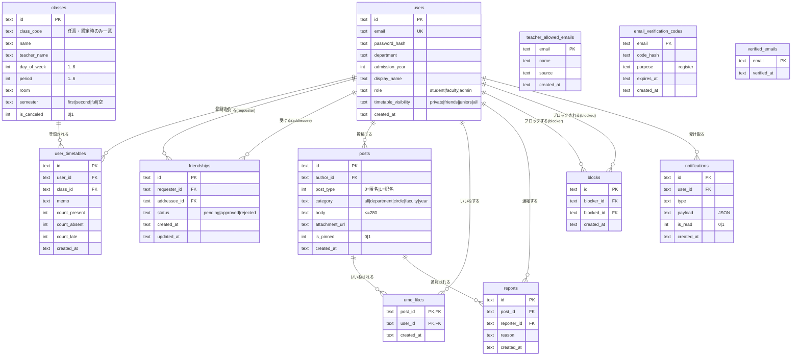

# データベース設計（ER図）

うめったーバックエンドのデータベーススキーマ。SQLite（ローカル）／ Cloudflare D1（本番・SQLite方言）で共通。

- マイグレーション: [`backend/internal/db/migrations/`](../backend/internal/db/migrations/)
  - `001_init.sql` … コアスキーマ（users 〜 notifications）
  - `002_teacher_email_verification.sql` … 教員メール許可リスト・メール確認
  - `003_seed_classes.sql` … 授業マスタの開発用シード
  - `004_align_design_schema.sql` … 当初ER設計に合わせた追加カラム（classes.class_code/semester, user_timetables.created_at, friendships.updated_at）
- マイグレーション管理: `migrations/*.sql` をファイル名順に**一度だけ**適用し、適用済みを `schema_migrations` テーブルで記録する（`ALTER TABLE ADD COLUMN` 等の非冪等な文も安全）。
- 共通方針: 主キーは `TEXT`（UUID）。日時は `TEXT`（RFC3339 / `strftime` のUTC文字列）。真偽値は `INTEGER`（0/1）。

## ER図

> メール確認系の3テーブル（`teacher_allowed_emails` / `email_verification_codes` / `verified_emails`）は `users.email` と値で対応するが、外部キー制約は張っていない（ユーザー作成前のフローでも使うため）。

## テーブル詳細

### users
ユーザーアカウント。メールアドレスから学科コード・入学年を抽出する（例: `ab24123@gm.tsuda.ac.jp` → `department='ab'`, `admission_year=2024`）。教員は `department='faculty'`, `admission_year=0`。

| カラム | 型 | 備考 |
|---|---|---|
| `id` | TEXT | PK（UUID） |
| `email` | TEXT | UNIQUE |
| `password_hash` | TEXT | bcrypt |
| `department` | TEXT | 学科コード |
| `admission_year` | INTEGER | 入学年（西暦） |
| `display_name` | TEXT | 表示名 |
| `role` | TEXT | `student` / `faculty` / `admin` |
| `timetable_visibility` | TEXT | `private` / `friends` / `juniors` / `all`（既定 `friends`） |
| `created_at` | TEXT | |

### classes
シラバス由来の授業マスタ（別途シード）。

| カラム | 型 | 備考 |
|---|---|---|
| `id` | TEXT | PK |
| `class_code` | TEXT | 授業コード（任意）。空文字は重複可、設定済みの値のみ一意（部分インデックス） |
| `name` | TEXT | 授業名 |
| `teacher_name` | TEXT | 教員名 |
| `day_of_week` | INTEGER | 1（月）〜6（土） |
| `period` | INTEGER | 1〜6限 |
| `room` | TEXT | 教室 |
| `semester` | TEXT | `first`（前期）/ `second`（後期）/ `full`（通年）/ 空文字（未設定） |
| `is_canceled` | INTEGER | 休講フラグ 0/1 |

### user_timetables
ユーザー × 授業の登録。出欠カウント・自由メモ・登録時刻（`created_at`）を持つ。`UNIQUE(user_id, class_id)` で同一授業の重複登録を防止。

### friendships
相互承認制の友達関係。`requester_id` が申請、`addressee_id` が承認/拒否。`updated_at` は申請作成・ステータス更新時に記録。`UNIQUE(requester_id, addressee_id)` で重複申請を防止。

### posts
匿名SNSの投稿。`post_type=0`（匿名）は API レスポンスで `author_id` をマスク。`body` は280文字以内。

### ume_likes
梅いいね。`PRIMARY KEY(post_id, user_id)` で 1ユーザー1投稿1いいね。

### reports
投稿通報。`UNIQUE(post_id, reporter_id)` で 1ユーザー1投稿1通報。

### blocks
ユーザー間の非表示。`UNIQUE(blocker_id, blocked_id)`。

### notifications
通知履歴。`payload` は種類ごとの JSON。`idx_notifications_user(user_id, is_read, created_at DESC)` を付与。

### teacher_allowed_emails / email_verification_codes / verified_emails
教員メール許可リストと、登録時メール確認のための一時コード・確認済みフラグ。詳細は [api.md](./api.md) の認証フローを参照。

## 主なインデックス

| インデックス | 対象 |
|---|---|
| `idx_posts_created_at` | `posts(created_at DESC)` |
| `idx_posts_category` | `posts(category)` |
| `idx_notifications_user` | `notifications(user_id, is_read, created_at DESC)` |
| `idx_classes_class_code` | `classes(class_code) WHERE class_code <> ''`（部分ユニーク） |
